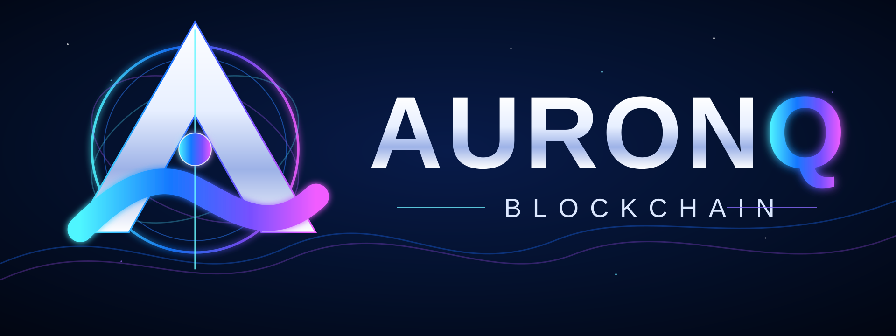

<p align="center">
  
</p>

<h1 align="center">AuronQ (AURQ)</h1>

<p align="center"><strong>Open-source public Proof-of-Work cryptocurrency network</strong></p>

<p align="center">
  <a href="https://github.com/promirmir/AuronQ/actions/workflows/ci.yml"></a>
  <a href="https://github.com/promirmir/AuronQ/actions/workflows/network-hardening.yml"></a>
  <a href="https://github.com/promirmir/AuronQ/actions/workflows/reproducible-builds.yml"></a>
  <a href="https://github.com/promirmir/AuronQ/releases/latest"></a>
  <a href="LICENSE"></a>
  <a href="go.mod"></a>
  <a href="https://github.com/promirmir/AuronQ/releases/tag/miner-v0.4.6-alpha"></a>
  
</p>

**AuronQ** is an open-source public cryptocurrency network written in Go. It combines a **UTXO ledger**, **Proof-of-Work**, **ML-DSA-87 post-quantum transaction signatures**, and the AuronQ-specific **AQM64** proof-of-work construction.

The AuronQ Mainnet is live. The project is designed around **independent full-node validation, replaceable peer discovery, local wallets, local explorers and no privileged founder node**.

## 🚀 Start here

| Run the network | Mine AURQ | Inspect the chain |
|---|---|---|
| **AuronQ Desktop / Full Node v1.7.13** | **AuronQ Universal Miner v0.4.6 Alpha** | **Public Explorer** |
| Windows + Linux full validating node, wallet and local Explorer | AUTO CUDA→Legacy CUDA→OpenCL→CPU fallback, Windows GUI, portable Windows/Linux/macOS CPU builds, Solo/Pool | Blocks, transactions, peers and network state |
| [⬇️ Windows x64](https://github.com/promirmir/AuronQ/releases/download/v1.7.13/AuronQ-1.7.13-Windows-x64.zip) · [Linux amd64](https://github.com/promirmir/AuronQ/releases/download/v1.7.13/AuronQ-1.7.13-Linux-amd64.tar.gz) | [⬇️ Windows x64 GUI/GPU](https://github.com/promirmir/AuronQ/releases/download/miner-v0.4.6-alpha/AuronQ-Miner-v0.4.6-alpha-Windows-x64-GUI-GPU.zip) · [Linux x64 GPU](https://github.com/promirmir/AuronQ/releases/download/miner-v0.4.6-alpha/AuronQ-Miner-v0.4.6-alpha-Linux-x64-GPU.tar.gz) · [All portable builds](https://github.com/promirmir/AuronQ/releases/tag/miner-v0.4.6-alpha) | [🌐 Open Explorer](https://mir.taild63f46.ts.net/explorer) |

> **Universal miner:** AUTO tries validated primary NVIDIA CUDA first, then the packaged legacy CUDA backend for older Maxwell/Pascal/Volta-class NVIDIA hardware, then vendor-neutral OpenCL GPU for AMD/Intel/NVIDIA, and finally the built-in CPU AQM64 backend. The CPU fallback uses a conservative memory/thread profile and is self-tested against canonical AQM64. Windows NVIDIA thermals use direct local NVML data. Portable CPU-safe CLI packages are CI-built for Windows x64/ARM64, Linux x64/ARM64 and macOS x64/ARM64. Pool mode can use a user-supplied compatible external miner; AuronQ does not silently download third-party binaries.

### Verify AuronQ yourself

AuronQ is intended to be evaluated through **public code and independently observable network data**, not promotional claims.

- **Source code:** https://github.com/promirmir/AuronQ
- **Latest releases:** https://github.com/promirmir/AuronQ/releases/latest
- **Public Explorer:** https://mir.taild63f46.ts.net/explorer
- **Protocol specification:** [PROTOCOL.md](PROTOCOL.md)
- **AQM64 specification:** [AQM64.md](AQM64.md)
- **Mining pools:** [MeshPool](https://meshpool.net/pool/auronq-main) · [RPlant](https://pool.rplant.xyz/#auronq#connect)
- **Independent tracking:** [MiningChamp](https://miningchamp.com/coin/auronq) · [CPU-Mining.info](https://cpu-mining.info/)

If you want to follow the project rather than actively participate, **Star** or **Watch** the repository to keep AuronQ in your GitHub feed.

> [!WARNING]
> AuronQ is a young public cryptocurrency network in an early stage of operational maturity. AQM64 and the complete consensus/network implementation have **not** yet received an independent professional security or cryptographic audit. Until that review is completed and the network has accumulated a longer operating history, do not use AuronQ to store or transfer substantial value.

## ⛏️ Official AuronQ Universal Miner v0.4.6 Alpha

The official miner now uses **AUTO compute selection**: primary NVIDIA CUDA → legacy NVIDIA CUDA → vendor-neutral OpenCL GPU → native CPU AQM64. The portable release matrix covers Windows x64/ARM64, Linux x64/ARM64 and macOS x64/ARM64; Windows x64 also has the PL/EN GUI.

<p align="center">
  <a href="https://github.com/promirmir/AuronQ/releases/download/miner-v0.4.6-alpha/AuronQ-Miner-v0.4.6-alpha-Windows-x64-GUI-GPU.zip"><strong>⬇️ Windows x64</strong></a>
  &nbsp;·&nbsp;
  <a href="https://github.com/promirmir/AuronQ/releases/download/miner-v0.4.6-alpha/AuronQ-Miner-v0.4.6-alpha-Linux-x64-GPU.tar.gz"><strong>⬇️ Linux amd64</strong></a>
  &nbsp;·&nbsp;
  <a href="GPU-MINER-GUIDE.md">User guide</a>
  &nbsp;·&nbsp;
  <a href="https://github.com/promirmir/AuronQ/releases/tag/miner-v0.4.6-alpha">Release page</a>
</p>

| Capability | v0.4.6 Alpha |
|---|---|
| AUTO backend | ✅ Canonical validation chain: primary CUDA → legacy CUDA (Maxwell/Pascal/Volta) → OpenCL GPU (AMD/Intel/NVIDIA) → CPU |
| Portable CPU platforms | ✅ Windows x64/ARM64 · Linux x64/ARM64 · macOS x64/ARM64 |
| NVIDIA GPUs | ✅ CUDA 13.2 for newer generations + CUDA 12.6 legacy backend for supported Maxwell/Pascal/Volta targets + OpenCL fallback |
| Multi-GPU work | ✅ Separate worker per GPU with disjoint nonce ranges |
| Automatic tuning | ✅ CUDA/OpenCL batch autotune; NVIDIA uses direct thermal control, generic OpenCL uses a conservative no-sensor duty profile |
| Live performance | ✅ Rolling H/s + GPU telemetry + Windows CPU utilization/name/logical CPUs/AQM64 threads/nominal clock/memory |
| Thermal protection | ✅ Smart Solo governor + stabilized AuronQ-side Pool duty controller, cooldown hold and independent catastrophic hard stop |
| Solo mining | ✅ Uses the ordinary AuronQ full-node template/validation path |
| Pool mode | ✅ First-class MeshMiner 0.8.35+ integration, MeshPool preset and compatible custom endpoints |
| Platforms / UI | ✅ Windows x64 GUI (PL/EN) · Linux amd64 CLI |
| Correctness check | ✅ CUDA/OpenCL/CPU backend vs canonical AQM64 equivalence self-test |

The miner remains **alpha software**. Multi-GPU and cross-vendor OpenCL behavior still need broader real-device coverage, and the CUDA/OpenCL accelerator implementations have not received an independent professional audit. A valid block found in Solo mode is still submitted to an ordinary AuronQ full node and must pass the same Mainnet validation rules as every other block.

## Long-term direction

AuronQ Mainnet is intended to be a **persistent public cryptocurrency network**, not a disposable test chain. The project is being developed with a long time horizon: preserve a stable consensus foundation, reduce dependence on privileged infrastructure, and let the network prove itself through real operation rather than frequent protocol redesign.

A core motivation is that computing hardware continues to become more capable. AuronQ therefore avoids simply copying an older mining design unchanged. Its **AQM64** Proof-of-Work deliberately uses a heavier compute-and-memory construction, while transaction authorization uses the standardized **ML-DSA-87** post-quantum signature scheme.

The goal is not to claim that any design is permanently future-proof. The goal is to give AuronQ a foundation that can remain useful as hardware and cryptographic requirements evolve, while keeping Mainnet compatibility and decentralization as primary constraints.

Accordingly, the development direction is:

- **stability before features** — avoid unnecessary consensus changes once Mainnet rules are established;
- **long-lived compatibility** — protect Network ID, genesis, monetary rules and transaction validity from casual redesign;
- **hardware-aware PoW** — keep AQM64 focused on meaningful resource use on modern general-purpose hardware;
- **post-quantum transaction signatures** — retain ML-DSA-87 as the transaction-signature foundation;
- **independent operation** — grow the number of unrelated miners, pools, full nodes, discovery routes and explorers;
- **real-world proving period** — let the live network accumulate operating history, external integrations and independent review before treating it as mature infrastructure;
- **security and auditability** — keep the code open, reproducible and reviewable, and pursue independent professional review before substantial-value use.

This direction is intentionally conservative: the aim is for AuronQ to survive technological change through stable rules, independent infrastructure and gradual hardening rather than constant consensus churn.

## Current releases

| Component | Current release | Status | Download |
|---|---:|---|---|
| Desktop / Full Node | **v1.7.13** | Mainnet | [Windows x64](https://github.com/promirmir/AuronQ/releases/download/v1.7.13/AuronQ-1.7.13-Windows-x64.zip) · [Linux amd64](https://github.com/promirmir/AuronQ/releases/download/v1.7.13/AuronQ-1.7.13-Linux-amd64.tar.gz) |
| Universal Miner | **v0.4.6 Alpha** | AUTO CUDA→Legacy CUDA→OpenCL→CPU · Windows GUI · portable Windows/Linux/macOS · safe fallback | [Windows x64 GUI/GPU](https://github.com/promirmir/AuronQ/releases/download/miner-v0.4.6-alpha/AuronQ-Miner-v0.4.6-alpha-Windows-x64-GUI-GPU.zip) · [Linux x64 GPU](https://github.com/promirmir/AuronQ/releases/download/miner-v0.4.6-alpha/AuronQ-Miner-v0.4.6-alpha-Linux-x64-GPU.tar.gz) · [portable builds](https://github.com/promirmir/AuronQ/releases/tag/miner-v0.4.6-alpha) |
| AuronQ Mobile | **0.5.3 Alpha** | Light wallet | [Android APK](https://github.com/promirmir/AuronQ/releases/download/android-v0.5.3-alpha/AuronQ-Mobile-0.5.3-alpha.apk) |

**Project site:** https://promirmir.github.io/AuronQ/

**New cryptocurrency / AURQ technical overview:** https://promirmir.github.io/AuronQ/new-cryptocurrency.html

**Official Bitcointalk ANN / community discussion:** https://bitcointalk.org/index.php?topic=5595868.0

**Official Discord community:** https://discord.gg/rmmNY9RhA

**Official project email:** auronqnetwork@gmail.com

**Official brand assets:** [assets/brand/](assets/brand/)

**Release archive:** [GitHub Releases](https://github.com/promirmir/AuronQ/releases) · **History:** [CHANGELOG.md](CHANGELOG.md)

## ⛏️ Mine AURQ

**Official miner:**
- **AuronQ Universal Miner v0.4.6 Alpha:** https://github.com/promirmir/AuronQ/releases/tag/miner-v0.4.6-alpha
- **Windows x64 GUI/GPU:** https://github.com/promirmir/AuronQ/releases/download/miner-v0.4.6-alpha/AuronQ-Miner-v0.4.6-alpha-Windows-x64-GUI-GPU.zip
- **Linux x64 GPU:** https://github.com/promirmir/AuronQ/releases/download/miner-v0.4.6-alpha/AuronQ-Miner-v0.4.6-alpha-Linux-x64-GPU.tar.gz
- **Portable Windows/Linux/macOS CPU-safe builds:** https://github.com/promirmir/AuronQ/releases/tag/miner-v0.4.6-alpha
- **Universal user guide:** [UNIVERSAL-MINER-GUIDE.md](UNIVERSAL-MINER-GUIDE.md)
- **NVIDIA accelerated guide:** [GPU-MINER-GUIDE.md](GPU-MINER-GUIDE.md)
- **Hardware support policy:** [HARDWARE-SUPPORT.md](HARDWARE-SUPPORT.md)
- **Technical CUDA notes:** [gpu/cuda/README.md](gpu/cuda/README.md)

**MeshMiner 0.8.35 integration:**
- AuronQ Pool mode can launch a user-supplied MeshMiner 0.8.35+ directly with `--algo auronq`.
- Supports CUDA, CPU or CUDA+CPU, selected NVIDIA devices, CPU thread override, `--fan auto` and an explicit Retune action.
- Windows Pool mode adds AuronQ-side autonomous thermal control from direct local NVML hardware samples, with smooth duty-cycle regulation, automatic cooldown/resume at the configured limit and fail-safe stop if temperature or telemetry becomes unsafe. Pool/miner-reported temperatures are not used for safety decisions.
- MeshMiner release: https://github.com/totom9000/meshminer/releases/tag/v.0.8.35
- MeshMiner 0.8.35 reports a **0.5% dev fee on MeshPool and 1.2% elsewhere**.
- The external binary is **not bundled or downloaded automatically**.

**Independent pools and third-party miners:**
- **MeshPool:** https://meshpool.net/pool/auronq-main
- **RPlant:** https://pool.rplant.xyz/#auronq#connect
- **MeshMiner 0.8.35:** https://github.com/totom9000/meshminer/releases/tag/v.0.8.35 — published AURQ support for CPU and NVIDIA GPUs

The official AuronQ miner provides primary CUDA, a packaged legacy CUDA path for older NVIDIA GPUs, vendor-neutral OpenCL GPU, **and native CPU fallback** paths. Its Pool mode is a launcher/bridge for a **user-supplied compatible external pool miner** because the AuronQ full node does not currently expose a native Stratum server. Third-party pools/miners are independently operated and are not part of AuronQ consensus. Verify fees, payout rules, binaries and connection parameters before use.


### Current checksums

```text
7a7ce3d0b31b290bb6a3e43ab357ec6977ee4e7098a7d950594eda6cb64b2ba1  AuronQ-1.7.13-Windows-x64.zip
2bdd1ffa72ca99c7395a146d21943e4aedcabe24cde123b5af8ff3c6c640ecb6  AuronQ-1.7.13-Linux-amd64.tar.gz
# Universal Miner v0.4.6 Alpha:
# verify against SHA256SUMS-AURONQ-MINER.txt on the miner-v0.4.6-alpha release page
913e723a5b918ecf76bc923b599f5196b2a3340ec554897aa084b7193f1b520c  AuronQ-Mobile-0.5.3-alpha.apk
```

## What has been built

| Area | Status | What AuronQ currently provides |
|---|---|---|
| Mainnet | ✅ Live | Fixed Network ID and genesis, persistent chain storage |
| Full-node validation | ✅ | Local validation of blocks, transactions, signatures, timestamps, difficulty and cumulative work |
| Wallets | ✅ | Local ML-DSA-87 wallet creation/import, send/receive and wallet history |
| Proof-of-Work | ✅ | AQM64 CPU mining and cumulative-work chain selection |
| P2P | ✅ | Persisted peers, peer gossip, replaceable seed hints, bounded bootstrap manifests and DNS-seed support |
| Founder-node independence | ✅ Tested | Regression test removes the original bootstrap node permanently and joins a fresh node through a surviving peer |
| Explorer | ✅ | Every full node serves its own read-only explorer from its locally validated chain |
| Explorer network | ✅ | Public explorers can surface alternative HTTPS explorers learned through native P2P gossip |
| Reorg resilience | ✅ | Higher-work fork validation, immediate post-reorg sync continuation |
| Network hardening | ✅ | 20-node partition/fork/restart convergence tests, netgroup diversity, Sybil/eclipse concentration limits |
| Fuzzing / race testing | ✅ | Transaction/block parser fuzzing and Linux race detector in CI |
| Reproducible builds | ✅ | Release-style deterministic build checks on Linux and Windows |
| Public health monitoring | ✅ | Scheduled checks for Network ID, height/tip agreement and Explorer availability |
| Android light client | ✅ Alpha | Local header/AQM64 verification plus verified-chain multi-peer wallet-state quorum |
| Independent external audit | ❌ Not yet | Required before treating AuronQ as mature financial infrastructure |
| Broad independent node/miner set | ⚠️ Developing | More independently operated public nodes and miners are required |

## Architecture

AuronQ follows a **full-node-first** model.

Each AuronQ full node:

- stores and validates its own canonical blockchain;
- independently verifies AQM64 proof-of-work and cumulative work;
- validates UTXO spends and ML-DSA-87 signatures locally;
- maintains its own mempool;
- discovers and persists peers;
- relays valid transactions and blocks;
- serves its own local read-only blockchain Explorer.

Bootstrap peers are **rendezvous hints, not authorities**. They cannot approve invalid blocks, select the canonical chain, change monetary rules or override a node's validation. Repeatedly failing seed peers are pruned from the running peer set.

See [DECENTRALIZATION.md](DECENTRALIZATION.md) and [NETWORK-INDEPENDENCE.md](NETWORK-INDEPENDENCE.md).

## Quick start — Windows

1. Download the current [Windows x64 release](https://github.com/promirmir/AuronQ/releases/download/v1.7.13/AuronQ-1.7.13-Windows-x64.zip).
2. Verify its SHA-256 against the value above.
3. Extract the **entire ZIP** to a new folder.
4. Run **`START-AURONQ.cmd`**.
5. Wait for the local full node to load and synchronize.
6. Create or import a wallet and **back it up before using it**.
7. Use the built-in Explorer, send/receive AURQ, and enable CPU mining only if you intentionally want to mine.

Persistent Desktop data is stored under:

`%AppData%\AuronQ`

Windows binaries are not currently Authenticode-signed, so SmartScreen may warn on first launch.

Detailed guide: [README-WINDOWS.md](README-WINDOWS.md)

## Third-party mining pools and miners

AURQ is now available through multiple independently operated mining services. These services and miners are **third-party infrastructure** and are not controlled, operated or endorsed by the AuronQ project.

### MeshPool

- AuronQ pool: https://meshpool.net/pool/auronq-main
- Coin: **AuronQ (AURQ)**
- Proof-of-Work: **AQM64**
- Independent pool operator.

### RPlant

- AuronQ connection page: https://pool.rplant.xyz/#auronq#connect
- Coin: **AuronQ (AURQ)**
- Proof-of-Work: **AQM64**
- Independent pool operator.

### MeshMiner

A third-party AURQ implementation is also available in **MeshMiner 0.8.35**:

https://github.com/totom9000/meshminer/releases/tag/v.0.8.35

The published release announcement reports AURQ support on **CPU and NVIDIA GPUs**. Hardware support, binaries and tuning are maintained independently from the AuronQ project.

Third-party availability can change. Before mining with any external service or binary, independently verify its current connection parameters, fees, payout policy, download source and miner compatibility.

Public mining/network tracking:
- **MiningChamp — AuronQ profile & statistics:** https://miningchamp.com/coin/auronq
- **MiningChamp — all pools:** https://miningchamp.com/pools
- **MiningChamp — all coins:** https://miningchamp.com
- **CPU-Mining.info:** https://cpu-mining.info/

**Pool operators:** see [POOL-INTEGRATION.md](POOL-INTEGRATION.md) for the current HTTP/JSON mining interface, AQM64 share-validation requirements, stale-work handling and the recommended independent-pool architecture. Public decentralization coordination remains tracked in [issue #66](https://github.com/promirmir/AuronQ/issues/66).

Solo CPU mining through an AuronQ full node remains supported and does not depend on any pool.

## Mainnet identity

| Parameter | Value |
|---|---|
| Symbol | **AURQ** |
| Ledger | UTXO |
| Transaction signatures | ML-DSA-87 |
| Proof-of-Work | AQM64 |
| Target block spacing | 600 seconds |
| Nominal supply cap | 21,000,000 AURQ |
| Genesis founder allocation | 210,000 AURQ |
| Coinbase maturity | 100 blocks |

**Network ID**

`44e62c2ace002a6660c14e252173c1aa303529c68e40c998e92da2b453f44f30b1e58c94d533587e2186004593fb856c433fcdb5418ed430ec8617e29529365c`

**Genesis hash**

`5750a455c04bfe93c9edfef1a12744b05e29ac6da1a9dd5b790566629dea2080c581beb2f0324efba2067c9efb113ed7a29598fd3ffbed965ced31f265d0cec4`

Canonical specification: [MAINNET.md](MAINNET.md)

## Explorer

There is **no canonical central AuronQ Explorer**.

Every full node exposes a read-only Explorer at:

`/explorer`

The Explorer reads that node's own independently validated canonical chain. A public Explorer can additionally show alternative HTTPS full-node Explorers learned through AuronQ peer gossip.

One currently reachable instance is:

`https://mir.taild63f46.ts.net/explorer`

Its availability does not determine consensus and it has no special authority.

## AuronQ Mobile

AuronQ Mobile 0.5.3 Alpha is a **light wallet, not a full node**.

It:

- keeps private keys and ML-DSA-87 signing local on the phone;
- independently validates the Mainnet header chain from embedded genesis;
- locally verifies AQM64 proof-of-work, difficulty, timestamps and hash continuity;
- accepts balance/history/UTXO state only from peers matching the verified header chain;
- compares canonical wallet state across agreeing peers and fails closed on conflicts;
- broadcasts locally signed transactions to agreeing verified-chain peers.

It does **not** reconstruct the entire UTXO set from every full block, so it must not be described as equivalent to a full node.

## Engineering milestones

- **Mainnet launch:** public Windows/Linux full-node releases with immutable Network ID and genesis.
- **Wallet safety:** guarded local wallet deletion and backup warnings.
- **Public networking:** HTTPS/DNS peer discovery, peer gossip, persistent peers and public endpoint advertisement.
- **Observability:** wallet history API and estimated network hash power.
- **Explorer:** built-in read-only Explorer, then Desktop integration and CSP hardening.
- **Resilience:** direct bootstrap fallbacks, faster reorg recovery, 20-node partition convergence and hourly public health checks.
- **P2P hardening:** peer netgroups, DNS parent-domain grouping and sync diversity.
- **Founder independence:** startup seeds made prunable/replaceable; regression tests remove the original bootstrap node.
- **Mobile trust reduction:** multi-peer agreement, then local header/AQM64 verification and verified-chain wallet-state quorum.
- **Build integrity:** deterministic/reproducible build checks on Linux and Windows.
- **Explorer decentralization:** peer-aware links between independently hosted full-node explorers.
- **Mining correctness:** CLI/Desktop miners now cancel stale templates when the canonical tip advances or reorgs.
- **Mining compatibility:** Universal Miner AUTO validates primary CUDA, then legacy CUDA for older NVIDIA generations, then OpenCL GPU, then native CPU AQM64; portable CPU packages are CI-built for Windows/Linux/macOS x64/ARM64, with Windows Pool/MeshMiner integration and local hardware fail-safes.

Detailed history: [CHANGELOG.md](CHANGELOG.md)

## Roadmap

### Stabilization and finalization gate

AuronQ Mainnet consensus rules are already frozen for ordinary patch releases under [MAINNET-CHANGE-POLICY.md](MAINNET-CHANGE-POLICY.md). The current priority is therefore **stability, independent operation and observation**, not further consensus development.

After a sustained period of stable Mainnet operation, no unresolved consensus or network-critical failures, and successful compatibility/safety checks, the project may enter a **finalization hardening** phase. That phase should strengthen protection of published tags/releases and repository rules while continuing to allow security and compatibility fixes that do not alter consensus.

The finalization criteria are tracked in [STABILIZATION.md](STABILIZATION.md).

The next engineering priorities are tracked in [ROADMAP.md](ROADMAP.md). The highest-value items are:

1. more independently operated public full nodes and miners;
2. additional discovery routes, including independently operated DNS seeds;
3. continued adversarial P2P / eclipse / Sybil / DoS testing;
4. further reduction of light-client trust in remote full-node state;
5. independent professional review of AQM64, consensus and networking;
6. production-grade signing/distribution hardening for binaries and mobile releases.

## Documentation

| Topic | Document |
|---|---|
| Mainnet specification | [MAINNET.md](MAINNET.md) |
| Stabilization / finalization gate | [STABILIZATION.md](STABILIZATION.md) |
| Protocol | [PROTOCOL.md](PROTOCOL.md) |
| AQM64 Proof-of-Work | [AQM64.md](AQM64.md) |
| Mining pool integration | [POOL-INTEGRATION.md](POOL-INTEGRATION.md) |
| Decentralization model | [DECENTRALIZATION.md](DECENTRALIZATION.md) |
| Network independence | [NETWORK-INDEPENDENCE.md](NETWORK-INDEPENDENCE.md) |
| Public networking | [PUBLIC-NETWORK.md](PUBLIC-NETWORK.md) |
| Threat model | [THREAT-MODEL.md](THREAT-MODEL.md) |
| Security policy | [SECURITY.md](SECURITY.md) |
| Test matrix | [TEST-MATRIX.md](TEST-MATRIX.md) |
| FAQ | [FAQ.md](FAQ.md) |
| Windows guide | [README-WINDOWS.md](README-WINDOWS.md) |
| Universal Miner guide | [UNIVERSAL-MINER-GUIDE.md](UNIVERSAL-MINER-GUIDE.md) |
| NVIDIA accelerated miner guide | [GPU-MINER-GUIDE.md](GPU-MINER-GUIDE.md) |
| Contributing | [CONTRIBUTING.md](CONTRIBUTING.md) |
| Release history | [CHANGELOG.md](CHANGELOG.md) |
| Historical material | [docs/archive/README.md](docs/archive/README.md) |

## Security

AuronQ's use of ML-DSA-87 provides a standardized post-quantum signature scheme for transactions. That **does not** prove that the complete cryptocurrency is post-quantum secure or production secure.

AQM64, consensus, networking, wallet behavior and implementation details still require independent review.

Please read [SECURITY.md](SECURITY.md) before reporting or evaluating security issues.

## Thank you

AuronQ is becoming a real public network because people are actually using it, testing it and challenging it.

Thank you to everyone who runs a node, mines AURQ, operates or tests a pool, tries the wallets and miners, checks the Explorer, reports bugs, asks difficult technical questions, reviews the code, shares independent measurements, or simply takes the time to follow the project and provide feedback.

Every independent node, miner, test, bug report and honest piece of criticism helps make the network more observable, more resilient and less dependent on any single person or machine.

Special thanks to the community members, pool operators, infrastructure providers and external services that have chosen to support or monitor AuronQ independently.

The project is still young, and that makes real-world participation especially valuable. Thank you to everyone contributing to that process.

## Contributing

Contributions, reproducible bug reports and independent review are welcome.

- [Contributing guide](CONTRIBUTING.md)
- [Security policy](SECURITY.md)
- [Issue tracker](https://github.com/promirmir/AuronQ/issues)
- [Pull requests](https://github.com/promirmir/AuronQ/pulls)
- [Bitcointalk ANN / community discussion](https://bitcointalk.org/index.php?topic=5595868.0)
- [Official Discord community](https://discord.gg/rmmNY9RhA)

## License

AuronQ is released under the [MIT License](LICENSE).
